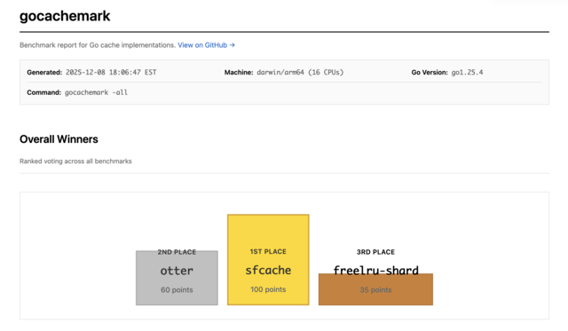

# gocachemark

A modern (2025) benchmarking tool for comparing Go cache implementations.

## Latest Results (December 8, 2025)

[](https://github.com/tstromberg/gocachemark/blob/main/latest/gocachemark-results.pdf)

**Top 3 performers:**
1. **sfcache** - 100 points
2. **otter** - 60 points
3. **freelru-shard** - 35 points

View the [full benchmark report](https://github.com/tstromberg/gocachemark/blob/main/latest/gocachemark-results.pdf) for detailed results across hit rate, latency, throughput, and memory benchmarks.

## Benchmarked caches

- [2q](https://github.com/hashicorp/golang-lru) - Two-queue cache
- [clock](https://github.com/Code-Hex/go-generics-cache) - CLOCK eviction algorithm
- [freecache](https://github.com/coocood/freecache) - Zero GC cache
- [freelru-shard](https://github.com/elastic/go-freelru) - GC-friendly sharded LRU from Elastic
- [freelru-sync](https://github.com/elastic/go-freelru) - GC-friendly synced LRU from Elastic
- [lru](https://github.com/hashicorp/golang-lru) - HashiCorp's LRU implementation
- [otter](https://github.com/maypok86/otter) - High-performance cache with S3-FIFO eviction
- [ristretto](https://github.com/dgraph-io/ristretto) - Fast concurrent cache from Dgraph
- [s3-fifo](https://github.com/scalalang2/golang-fifo) - S3-FIFO eviction algorithm
- [s4lru](https://github.com/dgryski/go-s4lru) - Segmented LRU
- [sfcache](https://github.com/codeGROOVE-dev/sfcache) - High-performance cache with W-TinyLFU
- [sieve](https://github.com/scalalang2/golang-fifo) - SIEVE eviction algorithm
- [theine](https://github.com/Yiling-J/theine-go) - High-performance in-memory cache
- [tinylfu](https://github.com/vmihailenco/go-tinylfu) - TinyLFU admission policy
- [ttlcache](https://github.com/jellydator/ttlcache) - Cache with per-item TTL support

## Installation

```bash
go install github.com/tstromberg/gocachemark@latest
```

## Usage

```bash
gocachemark -hitrate     # Run hit rate benchmarks (CDN, Meta, Zipf traces)
gocachemark -latency     # Run single-threaded latency (ns/op)
gocachemark -throughput  # Run multi-threaded throughput (QPS)
gocachemark -memory      # Run memory overhead benchmarks
gocachemark -all         # Run all benchmarks
```

### Options

- `-html <file>` - Output results to HTML file with charts (default: temp dir)
- `-open` - Open HTML report in browser after generation
- `-caches <list>` - Comma-separated caches to benchmark (default: all)
- `-tests <list>` - Comma-separated tests to run (default: all)

### Available Tests

- **Hit rate**: cdn, meta, zipf
- **Latency**: string, int
- **Throughput**: string-throughput, int-throughput
- **Memory**: memory

### Examples

```bash
gocachemark -latency -tests int -caches otter,sfcache
gocachemark -hitrate -tests cdn,zipf
gocachemark -all -caches otter,theine -html results.html -open
```

## Benchmarks

### Hit Rate

Measures cache hit rates using:
- **CDN trace** - Real production CDN access patterns
- **Meta trace** - Meta's KVCache production trace
- **Zipf synthetic** - Synthetic workload with Zipf distribution (alpha=0.8, 20:1 ops-to-key ratio)

### Latency

Single-threaded Get/Set latency in nanoseconds per operation.

### Throughput

Multi-threaded throughput (QPS) with 75% reads / 25% writes using Zipf workload.

### Memory

Memory overhead per cached item, measured in isolated processes for accuracy.


## Development

```bash
make build      # Build binary
make run        # Run all benchmarks
make hitrate    # Run hit rate benchmarks
make latency    # Run latency benchmarks
make throughput # Run throughput benchmarks
make html       # Generate HTML report
make lint       # Run linter
make deps       # Run go mod tidy
make clean      # Clean build artifacts
```
